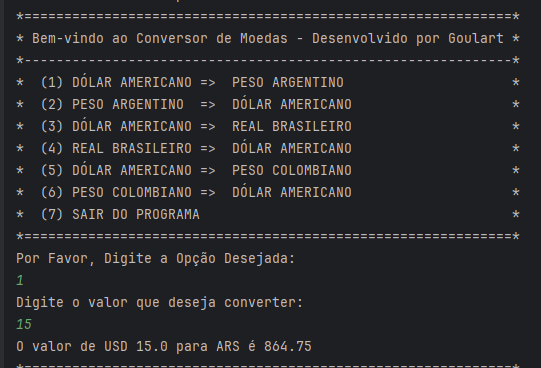

#  Conversor de Moedas em Java

##  Descrição
Este projeto é um Conversor de Moedas desenvolvido em Java, criado para demonstrar minhas habilidades em programação e aplicação dos conhecimentos adquiridos na formação Java Alura em parceria com a Oracle.

##  Funcionalidades Principais
* Interatividade do Usuário: Interface intuitiva e amigável para facilitar a interação do usuário com o conversor.
* Conversão em Tempo Real: Utilização de uma API de taxas de câmbio para obter as taxas atualizadas e realizar as conversões em tempo real.
* Filtragem de Moedas: Implementação de funcionalidades para filtrar e exibir apenas as moedas de interesse do usuário. Atualmente COP BRL ARS USD
* Exibição de Resultados: Apresentação clara e detalhada dos resultados das conversões, garantindo uma experiência completa ao usuário utilizando o console.

##  Tecnologias Utilizadas
- **Java:** Linguagem de programação principal para o desenvolvimento do projeto.
- **API HTTP:** Utilização de requisições HTTP para consumir os dados da API de taxas de câmbio.
- **JSON Parsing:** Análise e extração de dados da resposta JSON da API para obter as informações necessárias.
- **Gson:** Biblioteca para realizar o parsing de objetos JSON em Java de forma eficiente e fácil.
- **Git e GitHub:** Controle de versão e colaboração utilizando o Git e hospedagem do projeto no GitHub.

##   Objetivo
Este projeto foi desenvolvido com o objetivo de demonstrar minhas habilidades em programação Java, especialmente nas áreas de consumo de APIs, manipulação de dados JSON e desenvolvimento de aplicações interativas para o usuário. Estou empolgado para compartilhar meu trabalho e contribuir para desafios futuros!

##   Como Executar o Projeto
Clonar o Repositório: Clone o repositório deste projeto para sua máquina local usando o comando git clone.
Configuração do Ambiente: Certifique-se de ter o ambiente de desenvolvimento Java configurado corretamente em sua máquina.
Compilação e Execução: Compile e execute o projeto Java em sua IDE de preferência.
Interaja com o Conversor: Explore as funcionalidades do conversor de moedas, realizando conversões e verificando os resultados apresentados.
Contribuições e Feedback
Este projeto é uma demonstração das minhas habilidades em programação Java e estou aberto a feedback construtivo e sugestões de melhorias. Se você gostaria de colaborar ou tem alguma sugestão para o projeto, sinta-se à vontade para entrar em contato comigo. Estou sempre interessado em aprender e aprimorar minhas habilidades!

##  Contato
Nome: Leandro Goulart

LinkedIn: [Chega aqui](https://www.linkedin.com/in/leandrovgoulart/)

Portfolio: [Chega aqui](leandrogoulart.github.io/portfolio/)

Aluno Alura: [Chega aqui](https://cursos.alura.com.br/user/leandrovgoulart) T6 One

Estou ansioso para conectar e colaborar com outros profissionais da área! Obrigado por visitar este projeto e por considerar minhas habilidades para oportunidades futuras.